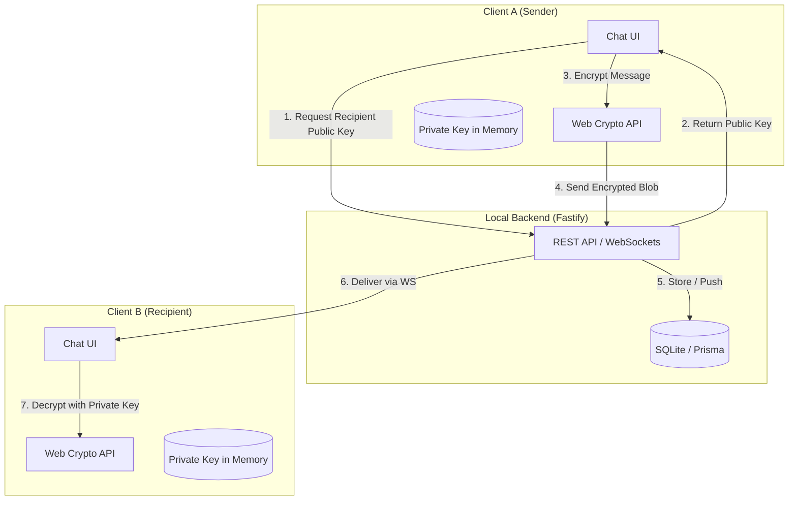

# 🤫 WhisperBox — End-to-End Encrypted Messaging

WhisperBox is a high-performance, **Zero-Knowledge** messaging application. It ensures total privacy by encrypting all data on the client before it ever touches the server. The server acts only as a secure relay for encrypted blobs.

---

## 🏗️ System Architecture



---

## 🔐 Encryption Flow

WhisperBox uses a **Hybrid Encryption** scheme combining asymmetric (RSA) and symmetric (AES) cryptography for maximum security and speed.

1.  **Session Key Generation**: For every message, a unique 256-bit **AES-GCM** key and a 96-bit IV are generated.
2.  **Message Encryption**: The plaintext message is converted to a JSON object (with a timestamp for replay protection) and encrypted using the AES-GCM key.
3.  **Key Wrapping (Recipient)**: The AES session key is encrypted with the **Recipient's RSA-OAEP 2048-bit Public Key**.
4.  **Key Wrapping (Self)**: The same AES session key is also encrypted with the **Sender's Public Key** (allowing the sender to view their own message history).
5.  **Transmission**: The final payload (Ciphertext, IV, and two encrypted keys) is sent to the server.

---

## 🔑 Key Management

### Secure Key Storage
*   **Public Keys**: Exported as SPKI (Base64) and stored on the server for discovery.
*   **Private Keys**: Never leave the client in plaintext. They are encrypted (wrapped) using a key derived from the user's password via **PBKDF2 (100,000 iterations)**.
*   **In-Memory Unwrapping**: When a user logs in, the wrapped private key is fetched, decrypted in the browser, and held strictly in **React State (Memory)**. 

---

## 🛡️ Security Trade-offs

| Feature | Trade-off | Rationale |
| :--- | :--- | :--- |
| **In-Memory Keys** | Session Lost on Refresh | We prioritize security over convenience. Storing the private key in `localStorage` makes it vulnerable to XSS attacks. |
| **RSA-OAEP** | Slower than ECC | RSA-OAEP is more widely supported and audited in the Web Crypto API, providing a stable foundation for E2EE. |
| **Centralized Relay** | Not Decentralized | Using a central Fastify server allows for high-performance WebSocket delivery while maintaining Zero-Knowledge privacy. |

---

## ⚠️ Known Limitations

1.  **Refresh = Logout**: Because keys are kept in memory, refreshing the page clears the session. The user must re-enter their password to re-unwrap the key.
2.  **Static Keys**: Currently uses static RSA keys. While secure, it does not support "Forward Secrecy" (where compromising one key doesn't compromise past messages).
3.  **Group Chat**: The current implementation is optimized for 1-on-1 messaging. Group E2EE would require a more complex "Sender Keys" architecture.

---

## 🚀 Local Development

### Prerequisites
- Node.js (v18+)
- SQLite

### Setup
1.  **Initialize Backend**:
    ```bash
    cd server
    npm install
    npm run db:init
    npm run db:seed  # Generates 15 test users
    ```
2.  **Start Services**:
    -   Backend: `npm run server:start`
    -   Frontend: `npm run dev`

### Credentials for Testing
- **Usernames**: `alice`, `bob`, `charlie`
- **Password**: `password123`
