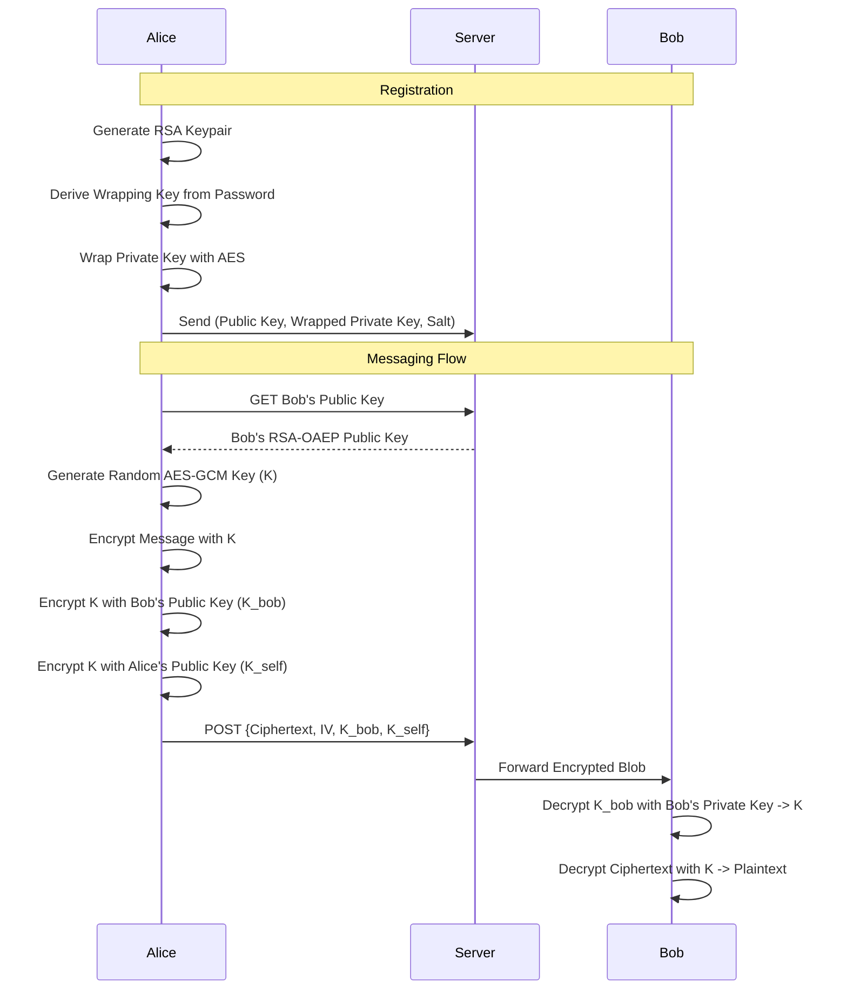

# WhisperBox — End-to-End Encrypted Messaging

WhisperBox is a secure messaging platform where privacy is the default. Built with a "Zero-Knowledge" architecture, the server facilitates communication without ever having access to the message content or the user's private keys.

## 🚀 Key Features
- **End-to-End Encryption (E2EE)**: Messages are encrypted on the sender's device and can only be decrypted by the recipient.
- **Secure Key Management**: Private keys are wrapped with a password-derived key (PBKDF2 + AES-KW) before being stored on the server.
- **Real-time Communication**: Low-latency messaging via WebSockets.
- **Privacy First**: No plaintext data ever leaves the client.

## 🏗 Architecture Diagram

### 🔐 Session Security & Persistence

WhisperBox prioritizes security over convenience. To ensure your private key is never exposed to persistent storage (like `localStorage` or `Cookies`):

- **In-Memory Keys**: Your RSA private key is unwrapped using your password and stored strictly in React state (memory).
- **Refresh Behavior**: When you refresh the page, the in-memory state is cleared. You will be redirected to the **Login** page to re-enter your password. This ensures that even if someone gains access to your computer, they cannot read your messages without your password.
- **Auto-Redirection**: The application is configured to intelligently redirect you to the Login page after a refresh if your session needs to be "unlocked".

---

## 🔒 Encryption Flow Explanation

### 1. User Registration & Key Setup
When a user registers, the client generates a 2048-bit RSA-OAEP keypair. To allow the user to access their account from multiple devices, the private key must be stored on the server. To keep it secure, we:
1.  Generate a 128-bit random salt.
2.  Use **PBKDF2** (SHA-256, 100k iterations) to derive a 256-bit key from the user's password.
3.  Use **AES-KW** to wrap (encrypt) the RSA private key with the derived key.
4.  Upload the public key, wrapped private key, and salt to the server.

### 2. The Hybrid Encryption Scheme
We use a hybrid approach to combine the speed of symmetric encryption with the security of asymmetric key exchange:
- **AES-GCM (256-bit)**: Used for encrypting the actual message content. A new random key and IV are generated for every single message.
- **RSA-OAEP (2048-bit)**: Used to securely "wrap" the AES key. The sender encrypts the AES key using the recipient's public key.

### 3. Message Self-History
To allow the sender to read their own sent messages in the history, the AES key is also encrypted with the **sender's own public key**. This `encryptedKeyForSelf` blob is stored alongside the message.

## 🛠 Security Trade-offs & Considerations
- **Metadata Visibility**: While message content is hidden, the server still knows *who* is talking to *whom* and *when*.
- **In-Memory Private Key**: The private key is kept in the React context state. If the user refreshes the page, the key is lost from memory, requiring a re-login to unwrap it again. This is a deliberate security choice to prevent plaintext keys from persisting in storage.
- **No Forward Secrecy (yet)**: The current implementation uses a static RSA key for key exchange. If the RSA private key is ever compromised, all past messages encrypted with it could be decrypted. Future versions could implement **Double Ratchet** (like Signal) for forward secrecy.

## 💻 Tech Stack
- **Frontend**: React (Vite), Vanilla CSS, Framer Motion.
- **Crypto**: Web Crypto API (Native browser implementation).
- **Icons**: Lucide-React.
- **API**: Axios with JWT interceptors.
